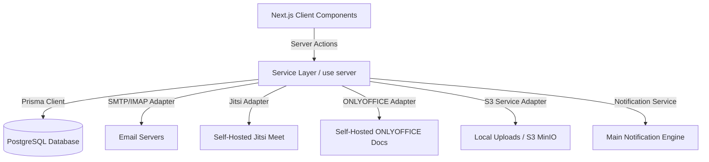

# Monolith Communication Hub Architecture

This document describes the high-level system architecture and patterns governing the **Monolith Communication Hub** module.

## Architectural Patterns

### 1. Server-Actions-Only Data Access Layer (`"use server"`)
To preserve consistency with Monolith Engine modules (e.g. `todo`), all state modifications and database queries are driven by Next.js Server Actions placed in `src/modules/communication/`.
- No inline database queries are allowed within client components.
- Services accept typed parameter inputs and validate them strictly using `zod` schemas.

### 2. Adapter Pattern for External Dependencies
To avoid hardcoding external dependencies and enable self-hosted alternatives, we utilize an Adapter interface for key features:
- **Jitsi Meet Adapter**: Abstract interface to generate rooms and generate secure JWTs or room keys.
- **ONLYOFFICE Adapter**: Abstract interface generating frames, JWT tokens, and managing version saves.
- **Mail Server Adapter**: Handles IMAP connection pooling and SMTP dispatch routing (using Nodemailer).
- **Storage Adapter**: Abstracts file writes. Uses a local file disk writer in development, and S3 SDK in production.

### 3. Real-Time Presences and Feed Updates
To avoid heavy WebSockets setup in early phases while keeping the UI responsive:
- **SSE/Polling Abstraction**: Presence map and message updates use a standardized polling wrapper that can be transparently swapped with WebSockets/Server-Sent Events (SSE) later.
- Polling uses debounced state locks and interval updates to protect DB performance.

### 4. Shared Org Scoping (Multi-Tenancy)
All records maintain a strict `orgId` binding matching the logged-in session. Cross-org queries are blocked programmatically inside all service layers.
- Every Prisma query specifies the `orgId` in its `where` clause.
- Access checks run before any create, read, update, or delete operations.
