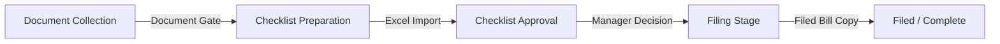

# Customs House Agent (CHA) Module Documentation

The Customs House Agent (CHA) workflow module manages customs clearance operations for imports and exports. It ensures compliance via strict document upload gates, manager checklist approvals, filing timeline tracking, advance collections, and multi-line expense vouchers.

---

## 1. Core Workflow Stages & Gates

The CHA job progresses through a linear 5-stage stepper workflow:

### Stage 1: Document Collection
- Operates as a gate before checklist preparation can begin.
- Enforces collection of mandatory documents mapped dynamically based on the Job Type (e.g., *Bill of Lading*, *Commercial Invoice*, and *Packing List* for Imports).
- Users can upload file copies or declare official **Document Exceptions** (exemption waiver justification reason).

### Stage 2: Checklist Preparation
- Unlocks only when all mandatory document requirements are marked `UPLOADED` or `NOT_AVAILABLE` (excepted).
- Supports parsing Excel questionnaires directly using the `xlsx` library to map sections, questions, and responses.
- Allows the job owner to review responses and submit the checklist for manager review. Alternatively, supports self-approval if enabled by organization policy.

### Stage 3: Checklist Approval
- Restricts edit operations on the questionnaire.
- Renders the review forms for assigned manager reviewers.
- **Decision Outcomes**:
  - `APPROVED`: Advances the job to the **Filing** stage and sets a default committed filing date (+3 days).
  - `REWORK`: Reverts the job back to the **Checklist Preparation** stage, generates a todo task for correction, and opens input slots for file corrections.

### Stage 4: Filing Stage
- Tracks customs submission timelines.
- Job owners can adjust estimated filing dates, creating a chronological audit trail log of committed timelines.
- Confirming filing requires:
  - Filing Reference ID (BOE/SB Ref).
  - Actual filing date.
  - Upload of the filed copy of the custom bill.
  - **Timeline Delay Verification**: If `actualFilingDate > estimatedFilingDate`, a justification reason is strictly mandatory.

---

## 2. Advanced Ledger Trackers

### Customer Advances Tracker
- Maps expected billing advances, collection due dates, and collection agent assignees.
- Supports waviers or posting partial payment receipts (recorded date, method, reference, and file proof).
- Sums payments to automatically transition status from `FOLLOW_UP` to `PARTIALLY_RECEIVED` or `FULLY_RECEIVED`.

### Operational Expenses Tracker
- Allows operational executives to request multi-line expenses (Customs Duty, Handling Charges, Transport).
- Supports immediate **Urgent Payment** escalations with mandatory justification notes.
- Accounts and Management executives can change statuses, post transactions disbursements (amount, date, method, proof screenshot), or raise written queries.
- Requester must review payout details and post an **Acknowledgment Receipt** to close the expense voucher cycle.

---

## 3. Database Schema Models

The module is powered by the following prisma models:

- `ChaSettings`: Global org-wide policies.
- `ChaJobType`: e.g. "Import Clearance", "Export Clearance".
- `ChaDocumentDefinition`: Templates of mandatory and optional documents per Job Type.
- `ChaJob`: Main operational job tracking stages and priorities.
- `ChaJobAssignment`: Employee role assignments mapping.
- `ChaJobDocumentRequirement`: Job-specific document checklist status.
- `ChaDocumentVersion`: Versioned S3/local file links.
- `ChaDocumentException`: Exemptions tracking reasons.
- `ChaChecklistImport`: Excel file reference and status.
- `ChaChecklistSection` & `ChaChecklistItem`: Hierarchical parsed questionnaire rows.
- `ChaChecklistApproval`: Manager signatures.
- `ChaChecklistReworkNote`: History of rework loops comments.
- `ChaFiling`: Submit timeline records and delays.
- `ChaFilingDateHistory`: Log of committed dates adjustments.
- `ChaCustomerAdvance`: Expected terms and waiver flags.
- `ChaCustomerAdvanceReceipt`: Individual payment vouchers.
- `ChaExpenseRequest`: Consolidated multi-line expense requisition vouchers.
- `ChaExpenseLine`: Detailed breakdown rows.
- `ChaExpensePayment`: Accounts payout transaction details.
- `ChaExpenseQuery`: Written discrepancy dialog threads.
- `ChaExpenseStatusHistory`: Transition history logs.
- `ChaAuditLog`: Milestone actions logs.

---

## 4. Role Based Access Control (RBAC)

Permissions registered under the `CHA` group:
- `cha.access`: Enter the module dashboard.
- `cha.dashboard.view`: View KPI panels.
- `cha.job.read`: Read job catalog.
- `cha.job.create` & `cha.job.update`: Operational CRUD.
- `cha.document.upload` & `cha.document.exception`: Manage doc requirements.
- `cha.checklist.prepare` & `cha.checklist.submit`: Excel ingestion and submissions.
- `cha.checklist.self_approve`: Wave manager routing.
- `cha.checklist.manager_approve`: Audit and rework decisions.
- `cha.filing.manage`: Confirmed BoE submissions and delay justifications.
- `cha.advance.manage`: Track client advance entries.
- `cha.expense.request`: Operational executives requesting money.
- `cha.expense.manage`: Review and change statuses.
- `cha.expense.pay`: Disburse cash payments.
- `cha.audit.view`: Access the audit milestone feeds.
- `cha.settings.manage`: Change global policies.
