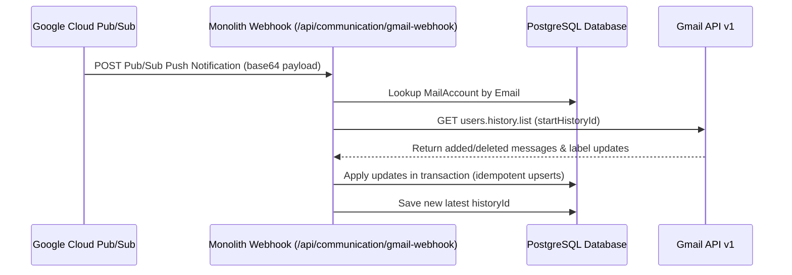

# Google Workspace & Gmail Integration: Technical Implementation Plan

This document details the architectural findings, database schemas, sync algorithms, and OAuth flows to connect Google Workspace and Gmail services directly into the Monolith Engine.

---

## 1. Current Architecture Findings

Monolith Engine is a Next.js App Router project utilizing TypeScript, Prisma, and PostgreSQL. 
The communication system currently features:
- **Internal Messaging Shell**: Located at `/src/app/(dashboard)/communication`.
- **Database Caches**: Standard tables like `MailAccount`, `MailThread`, `MailMessage`, `MailAttachment`, `MailLabel` designed to cache emails.
- **Server Actions**: Server functions inside `src/modules/communication` annotated with `"use server"` for RPC-like client interactions.
- **SMTP/IMAP Fallbacks**: Simple SMTP/IMAP configurations for self-hosted mailboxes, which act as a fallback when OAuth provider connections are not utilized.

---

## 2. Google Workspace API Capability Matrix

Monolith will leverage Google's official REST API endpoints:

| API | Service | Scope | Usage in Monolith |
|---|---|---|---|
| **Gmail API v1** | `users.messages`, `users.threads`, `users.drafts`, `users.history` | `gmail.modify`, `gmail.send` | Sync mailboxes, read details, manage drafts, delete messages, and dispatch outbound emails. |
| **People API** | `people.connections`, `people.directory` | `contacts.readonly` | Autocomplete email chips in composer, match sender names to corporate contacts. |
| **Google Calendar API** | `calendars`, `events` | `calendar` | Multi-directional sync of schedules, insert Google Meet links, handle RSVP events. |
| **Google Tasks API** | `tasklists`, `tasks` | `tasks` | View, add, check, and edit tasks, deep-linking Gmail items to tasks. |
| **Google Drive API** | `files` | `drive.readonly` | Attach files from Google Drive in the mail composer, save mail attachments back to Drive. |

---

## 3. Unsupported or Restricted Gmail Features

The following Gmail features are private or not exposed via the public Google APIs and will be omitted or handled with custom Monolith equivalents:
1. **Gmail Smart Reply & Smart Compose**: Automated text composition is powered by Google's proprietary server-side ML models and is not accessible.
2. **Gmail VIP Priority Inbox Classification**: Custom automated inbox sorting (Primary, Promotions, Forums) will be synced via standard categories, but category reassignment is handled on-client.
3. **Gmail Native Confidential Mode**: Email expiration and SMS passcode verification is proprietary. Monolith will implement standard MIME rendering.
4. **Google Chat API User Delegation**: Connecting a user's Chat session requires advanced Chat App authorization or service accounts with domain delegation. Direct user-gated workspace chat is limited; Monolith will utilize internal chat rooms as the primary chat engine.

---

## 4. Google Cloud Configuration

### Required Settings:
1. **Application Type**: Set to **Internal** (only allowing Workspace domain users) or **External/Testing** (requires adding test accounts).
2. **Authorized JavaScript Origins**: `http://localhost:3000`
3. **Authorized Redirect URIs**: `http://localhost:3000/api/auth/callback/google`
4. **Enabled APIs**: Gmail API, Google Calendar API, Google Tasks API, People API, Google Drive API.

---

## 5. Scope Justifications

- `openid email profile`: Basic identity verification and profile metadata ingestion.
- `https://www.googleapis.com/auth/gmail.modify`: Necessary to retrieve messages/threads, update labels (Inbox/Trash/Starred), and mark emails as read/unread.
- `https://www.googleapis.com/auth/gmail.send`: Crucial to permit the user to compose and dispatch emails directly through their Gmail account.
- `https://www.googleapis.com/auth/contacts.readonly`: Ingestion of Google Contacts to power the composer address book.
- `https://www.googleapis.com/auth/calendar`: Read/Write access to create events and add Google Meet video conferences.
- `https://www.googleapis.com/auth/tasks`: Integrates tasks from Monolith Tasks into Google Tasks.

---

## 6. Database and Synchronization Design

Incremental synchronization is achieved using the **Gmail History API** and **Google Cloud Pub/Sub Webhooks**:

### Models & Schema Upgrades
We will add fields to the `MailAccount` model:
- `historyId`: String mapping to the latest synced event.
- `watchResource`: String storing the Google Watch resource ID.
- `watchExpiration`: DateTime documenting subscription expiry.

---

## 7. Phased Implementation Checklist

- [ ] **Phase 1: OAuth Upgrades**: Update `src/lib/auth.ts` to request scopes and handle offline token refreshes.
- [ ] **Phase 2: Database Migration**: Add sync tracking fields to `schema.prisma` and run `db:push`.
- [ ] **Phase 3: Webhook Routing**: Add API endpoints for Pub/Sub push callbacks and cron watch renewals.
- [ ] **Phase 4: Incremental Sync Service**: Implement the history-based changes list parser.
- [ ] **Phase 5: Outbound Google Sending**: Integrate sending messages via Gmail API instead of SMTP fallback.
- [ ] **Phase 6: Multi-Service Adapters**: Build People API connection autocomplete, Google Tasks sync, and Calendar integrations.
- [ ] **Phase 7: Frontend Polish**: Revamp the Mail page to support Google Calendar meeting creation, address book lookup, and sync status checks.
