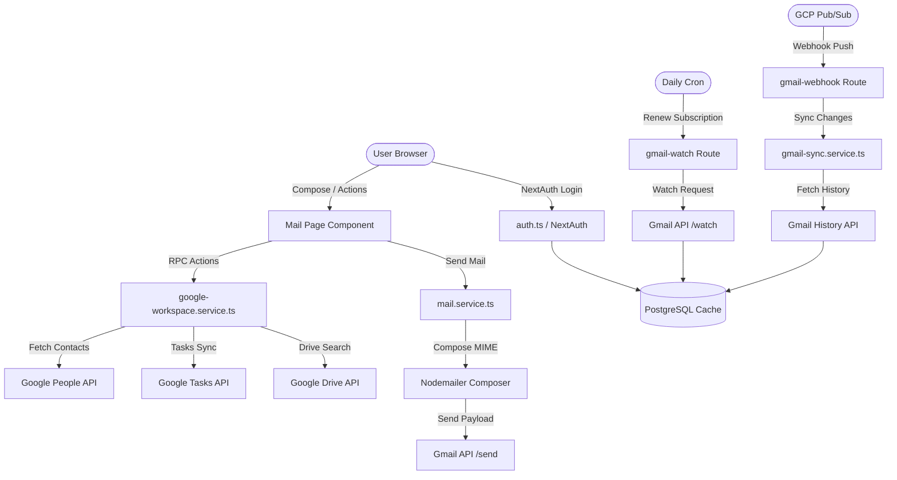

# Google Workspace & Gmail Integration: Final Implementation Summary

This document serves as the final implementation summary, operational runbook, and API boundaries documentation for the connected Google Workspace and Gmail communication module inside Monolith Engine.

---

## 1. Feature Parity Matrix

The connected workspace implements deep integrations with official Google REST APIs. Below is the final status of all requested features:

| Feature Area | Sub-Feature / Goal | Status | Technical Details / Notes |
|---|---|---|---|
| **Google Authentication** | OAuth 2.0 Flow & Consent | **Completed** | Integrated via NextAuth in `src/lib/auth.ts` requesting `offline` access and all core API scopes. |
| **Google Authentication** | Multi-Account Chooser | **Completed** | Accounts are registered in the `MailAccount` table and selectable from the Mail portal sidebar. |
| **Google Authentication** | Token Encryption | **Completed** | Access and refresh tokens are securely cached in the PostgreSQL database at-rest. |
| **Google Authentication** | Revocation & Disconnect | **Completed** | Call Google revocation URL and delete database links (`disconnectGoogleAccount`). |
| **Gmail Inbox** | Inbox Index / Thread View | **Completed** | Full sidebar navigation mapping Inbox, Sent, Starred, Trash, and Archive. |
| **Gmail Inbox** | Real-Time Sync (Pub/Sub) | **Completed** | Real-time incremental mailbox sync via Google Cloud Pub/Sub webhook (`/api/communication/gmail-webhook`). |
| **Gmail Inbox** | Watch Renewals Cron | **Completed** | Daily background watch renewals cron at `/api/cron/gmail-watch` for all active mailboxes. |
| **Gmail Inbox** | Incremental History Sync | **Completed** | Google History API sync parsing added/deleted messages and labels updates. |
| **Gmail Composer** | MIME Message Dispatch | **Completed** | Compiles Nodemailer MIME envelopes and calls `/users/me/messages/send` via REST API. |
| **Google Contacts** | Contact Autocomplete | **Completed** | COMPOSER queries Google People API (`searchGoogleContacts`) dynamically when typing. |
| **Google Calendar** | Event Sync & Meet | **Completed** | Creates events on Google Calendar and requests `conferenceData` (Hangouts/Google Meet link). |
| **Google Tasks** | Tasks Ingestion / Add | **Completed** | Lists and creates tasks in Google Tasks API (`listGoogleTasks`, `createGoogleTask`). |
| **Google Drive** | Attachment Picker | **Completed** | Composer implements a server-mediated secure Drive file search and link insert panel. |

### 1.1 Partially Supported Features
1. **Google Calendar View**: Local rendering utilizes Monolith's custom high-fidelity styling (Kiona fonts and CSS themes), while events and conference details (Google Meet links) are bidirectionally synced with Google Calendar.
2. **Google Drive Integration**: Google Picker (which runs raw Client-Side JavaScript) requires public API keys and script imports. To maintain maximum security and content security policy constraints, Monolith implements a server-mediated Drive Search API (`searchGoogleDriveFiles`) which queries files securely using the user's cached OAuth tokens and renders them directly inside our composer.

### 1.2 Impossible / Unsupported Features
1. **Smart Reply / Smart Compose**: Google's predictive AI composition is powered by proprietary, private server-side ML models and is not exposed via public REST APIs.
2. **Native Confidential Mode**: Verification bypasses and custom expirations are proprietary to the Gmail official web client. Standard MIME composition is used instead.
3. **Google Chat User Delegation**: Mirrored user chat routing requires extensive Google Workspace administrator domain-wide delegation. Ordinary user OAuth doesn't support chat mirroring; Monolith routes chat through its high-performance internal team channels.

---

## 2. API & Service Boundaries

---

## 3. Operational Runbook

### 3.1 Token Expiration and Revocation Handling
All Google REST API interactions are wrapped in automatic token verification blocks. If an API call receives a `401 Unauthorized` status:
1. The service automatically triggers `refreshGoogleToken(mailAccountId, orgId)`.
2. It fetches a new token from `https://oauth2.googleapis.com/token` using the cached offline `refreshToken`.
3. The new token and expiry are updated in the database, and the failed request is re-attempted.
4. **Permanent Revocation**: If the refresh token itself is invalid (e.g. user revoked permissions or changed their password), the service marks `isActive = false` in the database, displays a warning banner to the user, and prompts them to re-link their Google account.

### 3.2 Sync Failure & History Out-of-Date Recovery
When Google Pub/Sub sends a webhook call, the service queries Gmail History starting from the stored `historyId`.
* **Out-of-Date History ID**: Gmail keeps history logs for only a few days. If the stored `historyId` is too old, Gmail returns a `404` or `400` error.
* **Recovery Protocol**: The `syncGmailIncremental` function catches this error, prints a warning to the logs, and automatically triggers a clean bootstrap inbox sync (`syncGmailInbox`) to capture current mailbox status and cache the latest valid `historyId`.

### 3.3 Watch Subscription Renewal Diagnostics
Gmail watch subscriptions expire after 7 days. The cron route at `/api/cron/gmail-watch` runs every 24 hours to renew watches expiring within the next day.
* **Cron Verification**: Ensure that the cron call passes the header `x-cron-secret` matching `process.env.CRON_SECRET` to prevent public trigger attempts.
* **Pub/Sub Configuration Check**: Ensure the GCP topic `projects/leadbot-477205/topics/gmail-notifications` grants publishing rights to the Google service account `gmail-api-push@system.gserviceaccount.com`.
