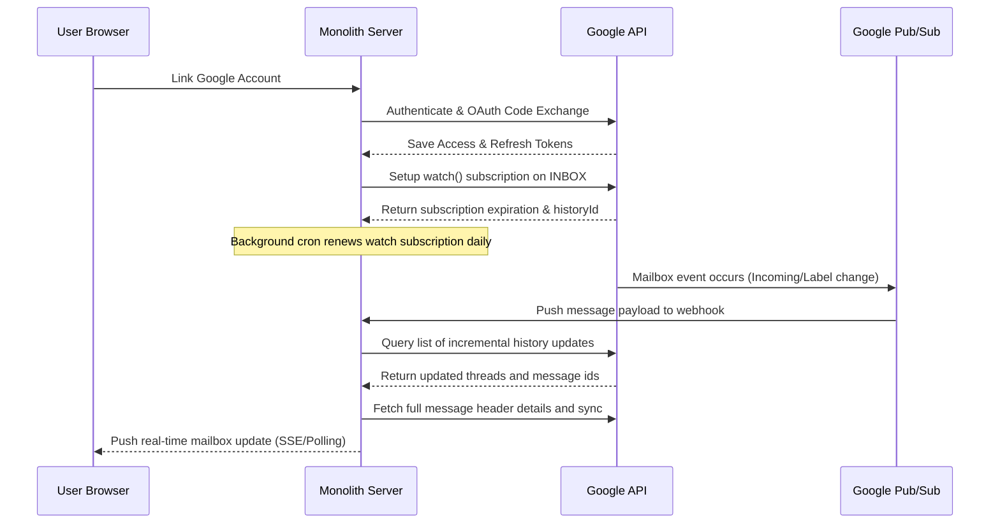

# Google Workspace Integration Architecture

This document describes the architectural layout, configuration matrix, and design considerations for implementing the Google Workspace and Gmail ecosystem inside the Monolith Engine.

## 1. Current Architecture Findings
* **Framework**: Next.js (app router) utilizing Server Actions (`"use server"`) as the exclusive data access layer.
* **Database**: PostgreSQL mapped via Prisma. The models `MailAccount`, `MailThread`, `MailMessage`, `MailAttachment`, `MailLabel`, `Calendar`, and `CalendarEvent` are already declared in the schema.
* **Authentication**: NextAuth.js integrates Google provider.
* **Scoping**: Strict organization-level scoping is enforced on all records using an `orgId` attribute to preserve multi-tenant boundary lines.

## 2. Google API Capability Matrix
* **Gmail REST API**: Used for fetching message headers, thread structures, and sending UTF-8 MIME messages.
* **Gmail Webhooks / Pub/Sub**: Pub/Sub topic subscription pushes instant push notifications to sync mailboxes incrementally.
* **People API**: Auto-completions, search, and details for Workspace contacts.
* **Google Tasks API**: Tasks CRUD operations mapped to lists.
* **Calendar API**: Event schedules, Meet links, attendee invitations, and free/busy lookups.
* **Google Picker / Drive API**: Google Drive picking, exporting attachments, and file details.

## 3. OAuth Scopes with Justification
* `openid profile email`: Basic authentication and user details matching.
* `https://www.googleapis.com/auth/gmail.modify`: Necessary to read, send, draft, label, star, archive, and trash emails.
* `https://www.googleapis.com/auth/calendar.events`: Create and manage Google Calendar events and Meet sessions.
* `https://www.googleapis.com/auth/contacts.readonly`: Autocomplete and search directories.
* `https://www.googleapis.com/auth/tasks`: Fetch and manipulate Google task lists.
* `https://www.googleapis.com/auth/drive.readonly`: Attach files from Google Drive.

## 4. Synchronization Loop

## 5. Rollout Strategy
* **Phase 1**: Configure GCP Console & OAuth credentials. Set up environment variables.
* **Phase 2**: Implement token security encryption helpers and connection buttons.
* **Phase 3**: Sync mail threads/labels and build the inbox dashboard.
* **Phase 4**: Setup Pub/Sub hooks and incremental sync cron tasks.
* **Phase 5**: Enable Google Calendar, Contacts, Tasks, and Drive integrations.
